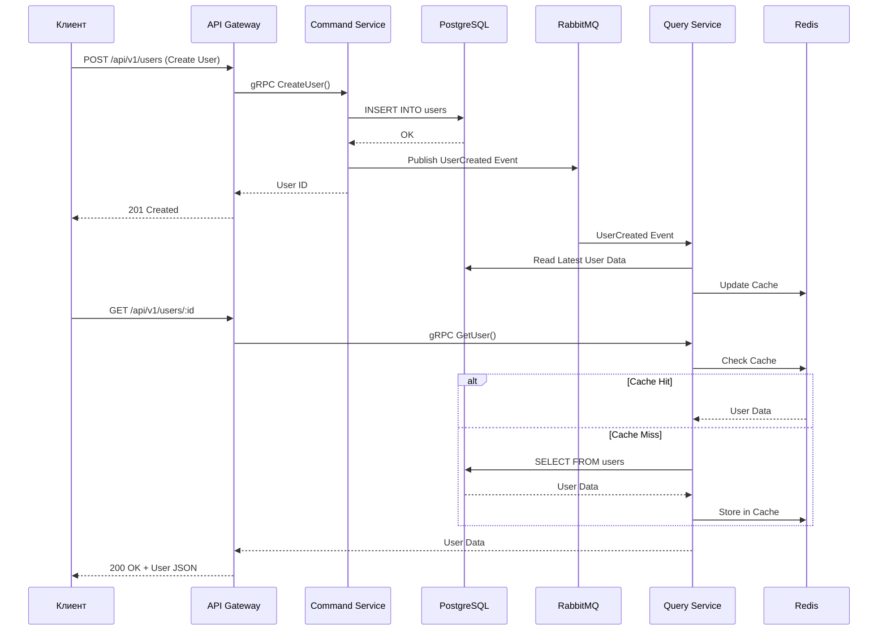
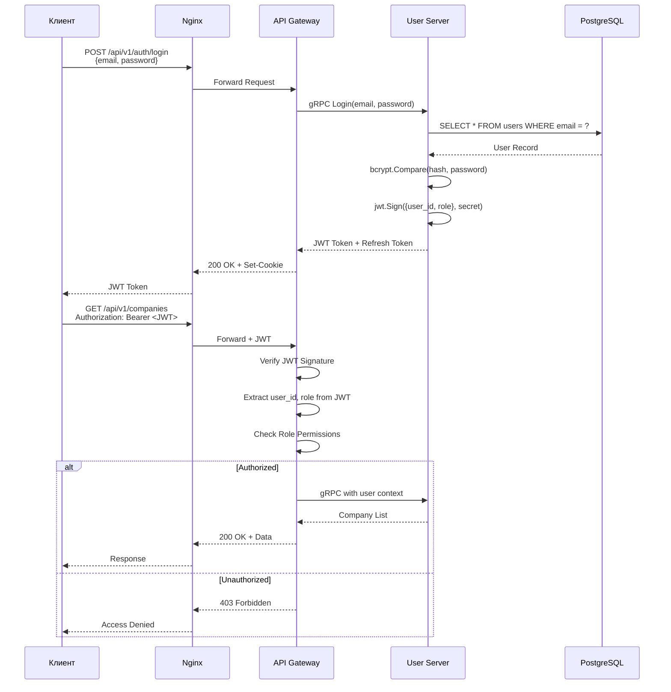
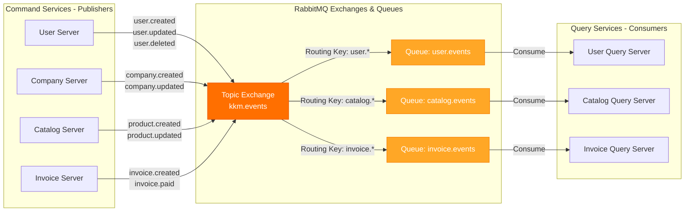
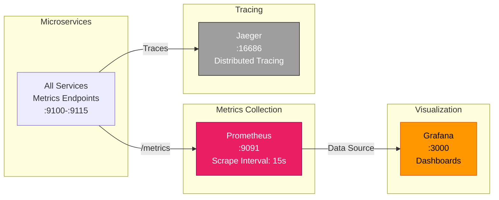

# 🏗️ Схема взаимодействия сервисов KKM Project MKS

> 📁 **Все диаграммы в PNG формате:** [docs/diagrams/](docs/diagrams/)
>
> - [Общая архитектура (4000x2677px, 627 KB)](docs/diagrams/overall-architecture.png)
> - [CQRS Pattern (2000x1337px, 104 KB)](docs/diagrams/cqrs-pattern.png)
> - [RabbitMQ Events (2500x899px, 97 KB)](docs/diagrams/rabbitmq-events.png)
> - [Auth Flow (2000x1403px, 132 KB)](docs/diagrams/auth-flow.png)

## 📊 Общая архитектура системы

> 🖼️ **PNG версия:** [docs/diagrams/overall-architecture.png](docs/diagrams/overall-architecture.png)

```mermaid
graph TB
    subgraph "Клиент"
        Client[Браузер / HTTP Client]
        Frontend[Next.js Frontend<br/>:4000]
    end

    subgraph "Entry Point"
        Nginx[Nginx Reverse Proxy<br/>:80/:443<br/>Rate Limiting, Gzip, SSL]
    end

    subgraph "API Layer"
        Gateway[API Gateway<br/>:8080 HTTP<br/>:9090 gRPC<br/>REST → gRPC Router]
    end

    subgraph "Command Services - CQRS Write Side"
        UserCmd[User Server<br/>:50051<br/>Metrics: 9101]
        CompanyCmd[Company Server<br/>:50052<br/>Metrics: 9103]
        CatalogCmd[Catalog Server<br/>:50053<br/>Metrics: 9105]
        InvoiceCmd[Invoice Server<br/>:50054<br/>Metrics: 9107]
        BankCmd[Bank Account Server<br/>:50055<br/>Metrics: 9109]
        ForeignCmd[Foreign Company Server<br/>:50056<br/>Metrics: 9111]
        DocumentCmd[Document Server<br/>:50057<br/>Metrics: 9113]
    end

    subgraph "Query Services - CQRS Read Side"
        UserQuery[User Query Server<br/>:50061<br/>Metrics: 9102]
        CatalogQuery[Catalog Query Server<br/>:50063<br/>Metrics: 9106]
        InvoiceQuery[Invoice Query Server<br/>:50064<br/>Metrics: 9108]
        BankQuery[Bank Account Query<br/>:50065<br/>Metrics: 9110]
        ForeignQuery[Foreign Company Query<br/>:50066<br/>Metrics: 9112]
        DocumentQuery[Document Query Server<br/>:50067<br/>Metrics: 9114]
    end

    subgraph "Analytics"
        Analytics[Analytics Server Python<br/>:50060<br/>Metrics: 9115]
    end

    subgraph "Message Broker"
        RabbitMQ[RabbitMQ<br/>:5672 AMQP<br/>:15672 Management UI<br/>События/Синхронизация]
    end

    subgraph "Data Layer - PostgreSQL DB per Service"
        DB_User[(postgres-user<br/>:5432<br/>user_db)]
        DB_Company[(postgres-company<br/>company_db)]
        DB_Catalog[(postgres-catalog<br/>catalog_db)]
        DB_Invoice[(postgres-invoice<br/>invoice_db)]
        DB_Bank[(postgres-bank-account<br/>bank_account_db)]
        DB_Foreign[(postgres-foreign-company<br/>foreign_company_db)]
        DB_Document[(postgres-document<br/>document_db)]
    end

    subgraph "Cache Layer"
        Redis[Redis<br/>:6379<br/>Query Cache &<br/>Session Storage]
    end

    subgraph "Observability Stack"
        Prometheus[Prometheus<br/>:9091<br/>Метрики]
        Grafana[Grafana<br/>:3000<br/>Визуализация]
        Jaeger[Jaeger<br/>:16686<br/>Distributed Tracing]
    end

    %% Client Flow
    Client -->|HTTP/HTTPS| Nginx
    Client -->|HTTP :4000| Frontend
    Frontend -->|HTTP API| Nginx
    Nginx -->|HTTP :8080| Gateway

    %% API Gateway to Services
    Gateway -->|gRPC| UserCmd
    Gateway -->|gRPC| CompanyCmd
    Gateway -->|gRPC| CatalogCmd
    Gateway -->|gRPC| InvoiceCmd
    Gateway -->|gRPC| BankCmd
    Gateway -->|gRPC| ForeignCmd
    Gateway -->|gRPC| DocumentCmd

    Gateway -->|gRPC| UserQuery
    Gateway -->|gRPC| CatalogQuery
    Gateway -->|gRPC| InvoiceQuery
    Gateway -->|gRPC| BankQuery
    Gateway -->|gRPC| ForeignQuery
    Gateway -->|gRPC| DocumentQuery
    Gateway -->|gRPC| Analytics

    %% Command Services to Databases
    UserCmd -->|Write| DB_User
    CompanyCmd -->|Write| DB_Company
    CatalogCmd -->|Write| DB_Catalog
    InvoiceCmd -->|Write| DB_Invoice
    BankCmd -->|Write| DB_Bank
    ForeignCmd -->|Write| DB_Foreign
    DocumentCmd -->|Write| DB_Document

    %% Command Services to RabbitMQ (Events)
    UserCmd -->|Publish Events| RabbitMQ
    CompanyCmd -->|Publish Events| RabbitMQ
    CatalogCmd -->|Publish Events| RabbitMQ
    InvoiceCmd -->|Publish Events| RabbitMQ
    BankCmd -->|Publish Events| RabbitMQ
    ForeignCmd -->|Publish Events| RabbitMQ
    DocumentCmd -->|Publish Events| RabbitMQ

    %% Query Services from RabbitMQ (Event Handlers)
    RabbitMQ -->|Subscribe Events| UserQuery
    RabbitMQ -->|Subscribe Events| CatalogQuery
    RabbitMQ -->|Subscribe Events| InvoiceQuery
    RabbitMQ -->|Subscribe Events| BankQuery
    RabbitMQ -->|Subscribe Events| ForeignQuery
    RabbitMQ -->|Subscribe Events| DocumentQuery

    %% Query Services to Databases
    UserQuery -->|Read| DB_User
    CatalogQuery -->|Read| DB_Catalog
    InvoiceQuery -->|Read| DB_Invoice
    BankQuery -->|Read| DB_Bank
    ForeignQuery -->|Read| DB_Foreign
    DocumentQuery -->|Read| DB_Document

    %% Query Services to Redis
    UserQuery <-->|Cache| Redis
    CatalogQuery <-->|Cache| Redis
    InvoiceQuery <-->|Cache| Redis
    BankQuery <-->|Cache| Redis
    ForeignQuery <-->|Cache| Redis
    DocumentQuery <-->|Cache| Redis

    %% Analytics Server
    Analytics -->|Read Aggregated Data| DB_User
    Analytics -->|Read Aggregated Data| DB_Company
    Analytics -->|Read Aggregated Data| DB_Invoice
    Analytics <-->|Cache| Redis

    %% Monitoring
    UserCmd -->|Metrics :9101| Prometheus
    CompanyCmd -->|Metrics :9103| Prometheus
    CatalogCmd -->|Metrics :9105| Prometheus
    InvoiceCmd -->|Metrics :9107| Prometheus
    BankCmd -->|Metrics :9109| Prometheus
    ForeignCmd -->|Metrics :9111| Prometheus
    DocumentCmd -->|Metrics :9113| Prometheus

    UserQuery -->|Metrics :9102| Prometheus
    CatalogQuery -->|Metrics :9106| Prometheus
    InvoiceQuery -->|Metrics :9108| Prometheus
    BankQuery -->|Metrics :9110| Prometheus
    ForeignQuery -->|Metrics :9112| Prometheus
    DocumentQuery -->|Metrics :9114| Prometheus
    Analytics -->|Metrics :9115| Prometheus

    Gateway -->|Metrics :9090| Prometheus
    Nginx -->|Metrics :9100| Prometheus

    Prometheus -->|Data Source| Grafana

    Gateway -->|Traces| Jaeger
    UserCmd -->|Traces| Jaeger
    CompanyCmd -->|Traces| Jaeger
    UserQuery -->|Traces| Jaeger

    style Nginx fill:#ff9800,stroke:#e65100,color:#000
    style Gateway fill:#2196f3,stroke:#0d47a1,color:#fff
    style Frontend fill:#00bcd4,stroke:#006064,color:#fff

    style UserCmd fill:#4caf50,stroke:#1b5e20,color:#fff
    style CompanyCmd fill:#4caf50,stroke:#1b5e20,color:#fff
    style CatalogCmd fill:#4caf50,stroke:#1b5e20,color:#fff
    style InvoiceCmd fill:#4caf50,stroke:#1b5e20,color:#fff
    style BankCmd fill:#4caf50,stroke:#1b5e20,color:#fff
    style ForeignCmd fill:#4caf50,stroke:#1b5e20,color:#fff
    style DocumentCmd fill:#4caf50,stroke:#1b5e20,color:#fff

    style UserQuery fill:#9c27b0,stroke:#4a148c,color:#fff
    style CatalogQuery fill:#9c27b0,stroke:#4a148c,color:#fff
    style InvoiceQuery fill:#9c27b0,stroke:#4a148c,color:#fff
    style BankQuery fill:#9c27b0,stroke:#4a148c,color:#fff
    style ForeignQuery fill:#9c27b0,stroke:#4a148c,color:#fff
    style DocumentQuery fill:#9c27b0,stroke:#4a148c,color:#fff

    style Analytics fill:#ff5722,stroke:#bf360c,color:#fff

    style RabbitMQ fill:#ff6f00,stroke:#e65100,color:#fff
    style Redis fill:#f44336,stroke:#b71c1c,color:#fff

    style Prometheus fill:#e91e63,stroke:#880e4f,color:#fff
    style Grafana fill:#ff9800,stroke:#e65100,color:#000
    style Jaeger fill:#9e9e9e,stroke:#212121,color:#fff
```

## 🔄 Паттерн CQRS (Command Query Responsibility Segregation)

### Принцип работы

> 🖼️ **PNG версия:** [docs/diagrams/cqrs-pattern.png](docs/diagrams/cqrs-pattern.png)



### Разделение ответственности

| Аспект          | Command Services           | Query Services               |
| --------------- | -------------------------- | ---------------------------- |
| **Назначение**  | Изменение данных (Write)   | Чтение данных (Read)         |
| **Операции**    | Create, Update, Delete     | Get, List, Search            |
| **База данных** | Прямая запись в PostgreSQL | Чтение из PostgreSQL + Redis |
| **Кэширование** | Нет                        | Redis для быстрого доступа   |
| **События**     | Публикуют в RabbitMQ       | Подписаны на RabbitMQ        |
| **Оптимизация** | ACID транзакции            | Денормализованные данные     |
| **Порты**       | 50051-50057                | 50061-50067                  |

## 🗂️ Таблица всех сервисов

| Сервис                           | Тип           | gRPC Port                   | Metrics Port | База данных                   | Redis DB | Назначение                         |
| -------------------------------- | ------------- | --------------------------- | ------------ | ----------------------------- | -------- | ---------------------------------- |
| **user-server**                  | Command       | 50051                       | 9101         | postgres-user:5432            | -        | Управление пользователями          |
| **user-query-server**            | Query         | 50061                       | 9102         | postgres-user:5432            | 0        | Чтение пользователей               |
| **company-server**               | Command       | 50052                       | 9103         | postgres-company:5432         | -        | Управление компаниями              |
| **catalog-server**               | Command       | 50053                       | 9105         | postgres-catalog:5432         | -        | Управление каталогом               |
| **catalog-query-server**         | Query         | 50063                       | 9106         | postgres-catalog:5432         | 2        | Чтение каталога                    |
| **invoice-server**               | Command       | 50054                       | 9107         | postgres-invoice:5432         | -        | Управление счетами                 |
| **invoice-query-server**         | Query         | 50064                       | 9108         | postgres-invoice:5432         | 3        | Чтение счетов                      |
| **bank-account-server**          | Command       | 50055                       | 9109         | postgres-bank-account:5432    | -        | Управление счетами банков          |
| **bank-account-query-server**    | Query         | 50065                       | 9110         | postgres-bank-account:5432    | 4        | Чтение банковских счетов           |
| **foreign-company-server**       | Command       | 50056                       | 9111         | postgres-foreign-company:5432 | -        | Управление иностранными компаниями |
| **foreign-company-query-server** | Query         | 50066                       | 9112         | postgres-foreign-company:5432 | 5        | Чтение иностранных компаний        |
| **document-server**              | Command       | 50057                       | 9113         | postgres-document:5432        | -        | Управление документами             |
| **document-query-server**        | Query         | 50067                       | 9114         | postgres-document:5432        | 6        | Чтение документов                  |
| **analytics-server-python**      | Analytics     | 50060                       | 9115         | Агрегация из всех БД          | 7        | Аналитика и отчеты                 |
| **api-gateway**                  | Gateway       | 8080 (HTTP)<br/>9090 (gRPC) | 9090         | -                             | -        | HTTP → gRPC маршрутизация          |
| **nginx-proxy**                  | Reverse Proxy | 80, 443                     | 9100         | -                             | -        | Entry point, rate limiting, SSL    |
| **kkm-platform**                 | Frontend      | 4000                        | -            | -                             | -        | Next.js веб-приложение             |

## 🔐 Схема аутентификации и авторизации

> 🖼️ **PNG версия:** [docs/diagrams/auth-flow.png](docs/diagrams/auth-flow.png)



### JWT структура

- **Header**: `{"alg": "HS256", "typ": "JWT"}`
- **Payload**:
  ```json
  {
    "user_id": "uuid",
    "email": "user@example.com",
    "role": "admin|user",
    "company_id": "uuid",
    "exp": 1706702400,
    "iat": 1706616000
  }
  ```
- **Secret**: Хранится в переменной окружения `JWT_SECRET` (минимум 32 символа)

## 📡 Схема взаимодействия с RabbitMQ

> 🖼️ **PNG версия:** [docs/diagrams/rabbitmq-events.png](docs/diagrams/rabbitmq-events.png)



### Типы событий

| Событие               | Routing Key       | Payload                                 | Подписчики                             |
| --------------------- | ----------------- | --------------------------------------- | -------------------------------------- |
| Пользователь создан   | `user.created`    | `{user_id, email, role, created_at}`    | user-query-server                      |
| Пользователь обновлен | `user.updated`    | `{user_id, fields_changed, updated_at}` | user-query-server                      |
| Пользователь удален   | `user.deleted`    | `{user_id, deleted_at}`                 | user-query-server                      |
| Компания создана      | `company.created` | `{company_id, name, inn, user_id}`      | user-query-server                      |
| Товар создан          | `product.created` | `{product_id, name, price, company_id}` | catalog-query-server                   |
| Счет создан           | `invoice.created` | `{invoice_id, total, company_id}`       | invoice-query-server, analytics-server |
| Счет оплачен          | `invoice.paid`    | `{invoice_id, paid_at, amount}`         | invoice-query-server, analytics-server |

## 🗄️ Схема баз данных (Database per Service)

```mermaid
graph TB
    subgraph "PostgreSQL Instances"
        DB1[postgres-user:5432<br/>user_db]
        DB2[postgres-company:5432<br/>company_db]
        DB3[postgres-catalog:5432<br/>catalog_db]
        DB4[postgres-invoice:5432<br/>invoice_db]
        DB5[postgres-bank-account:5432<br/>bank_account_db]
        DB6[postgres-foreign-company:5432<br/>foreign_company_db]
        DB7[postgres-document:5432<br/>document_db]
    end

    subgraph "Command Services"
        C1[User Server]
        C2[Company Server]
        C3[Catalog Server]
        C4[Invoice Server]
        C5[Bank Account Server]
        C6[Foreign Company Server]
        C7[Document Server]
    end

    subgraph "Query Services"
        Q1[User Query]
        Q2[Catalog Query]
        Q3[Invoice Query]
        Q4[Bank Query]
        Q5[Foreign Query]
        Q6[Document Query]
    end

    C1 -->|Write| DB1
    Q1 -->|Read| DB1

    C2 -->|Write| DB2

    C3 -->|Write| DB3
    Q2 -->|Read| DB3

    C4 -->|Write| DB4
    Q3 -->|Read| DB4

    C5 -->|Write| DB5
    Q4 -->|Read| DB5

    C6 -->|Write| DB6
    Q5 -->|Read| DB6

    C7 -->|Write| DB7
    Q6 -->|Read| DB7

    style DB1 fill:#1976d2,stroke:#0d47a1,color:#fff
    style DB2 fill:#1976d2,stroke:#0d47a1,color:#fff
    style DB3 fill:#1976d2,stroke:#0d47a1,color:#fff
    style DB4 fill:#1976d2,stroke:#0d47a1,color:#fff
    style DB5 fill:#1976d2,stroke:#0d47a1,color:#fff
    style DB6 fill:#1976d2,stroke:#0d47a1,color:#fff
    style DB7 fill:#1976d2,stroke:#0d47a1,color:#fff
```



### Структура баз данных

#### user_db

- **Таблицы**: `users`, `user_sessions`, `roles`, `permissions`
- **Владелец**: user_svc
- **Порт**: 5432
- **Связи**: Внешние ключи отсутствуют (микросервисная изоляция)

#### company_db

- **Таблицы**: `companies`, `company_users`, `company_settings`
- **Владелец**: company_svc
- **Связи**: `user_id` хранится как строка (не FK)

#### catalog_db

- **Таблицы**: `products`, `categories`, `units`, `product_prices`
- **Владелец**: catalog_svc
- **Связи**: `company_id` хранится как строка

#### invoice_db

- **Таблицы**: `invoices`, `invoice_items`, `invoice_payments`
- **Владелец**: invoice_svc
- **Связи**: `company_id`, `product_id` хранятся как строки

## 📊 Схема мониторинга



### Метрики Prometheus

Каждый сервис экспортирует стандартные метрики:

- **HTTP метрики** (API Gateway):
  - `http_requests_total{method, path, status}`
  - `http_request_duration_seconds{method, path}`
  - `http_requests_in_flight`

- **gRPC метрики** (все сервисы):
  - `grpc_server_handled_total{service, method, code}`
  - `grpc_server_handling_seconds{service, method}`
  - `grpc_server_started_total{service, method}`

- **Database метрики**:
  - `db_connections_active`
  - `db_connections_idle`
  - `db_query_duration_seconds`

- **Redis метрики**:
  - `redis_hits_total`
  - `redis_misses_total`
  - `redis_operation_duration_seconds`

- **RabbitMQ метрики**:
  - `rabbitmq_messages_published_total`
  - `rabbitmq_messages_consumed_total`
  - `rabbitmq_queue_length`

### Дашборды Grafana

Расположение: `monitoring/grafana-dashboard-*.json`

1. **Overview Dashboard** - общая картина системы
2. **Detailed Dashboard** - детальные метрики по сервисам
3. **Nginx Dashboard** - метрики прокси-сервера

## 🌐 HTTP REST API маршруты

API Gateway предоставляет REST API поверх gRPC сервисов:

### Базовый URL

```
http://localhost/api/v1
```

### Endpoints

| Метод                 | Путь                   | gRPC Service                 | Command/Query |
| --------------------- | ---------------------- | ---------------------------- | ------------- |
| **Authentication**    |                        |                              |               |
| POST                  | `/auth/login`          | user-server                  | Command       |
| POST                  | `/auth/register`       | user-server                  | Command       |
| POST                  | `/auth/logout`         | user-server                  | Command       |
| POST                  | `/auth/refresh`        | user-server                  | Command       |
| **Users**             |                        |                              |               |
| GET                   | `/users`               | user-query-server            | Query         |
| GET                   | `/users/:id`           | user-query-server            | Query         |
| POST                  | `/users`               | user-server                  | Command       |
| PUT                   | `/users/:id`           | user-server                  | Command       |
| DELETE                | `/users/:id`           | user-server                  | Command       |
| **Companies**         |                        |                              |               |
| GET                   | `/companies`           | company-server               | Command/Query |
| GET                   | `/companies/:id`       | company-server               | Command/Query |
| POST                  | `/companies`           | company-server               | Command       |
| PUT                   | `/companies/:id`       | company-server               | Command       |
| DELETE                | `/companies/:id`       | company-server               | Command       |
| **Catalog**           |                        |                              |               |
| GET                   | `/products`            | catalog-query-server         | Query         |
| GET                   | `/products/:id`        | catalog-query-server         | Query         |
| POST                  | `/products`            | catalog-server               | Command       |
| PUT                   | `/products/:id`        | catalog-server               | Command       |
| DELETE                | `/products/:id`        | catalog-server               | Command       |
| **Invoices**          |                        |                              |               |
| GET                   | `/invoices`            | invoice-query-server         | Query         |
| GET                   | `/invoices/:id`        | invoice-query-server         | Query         |
| POST                  | `/invoices`            | invoice-server               | Command       |
| PUT                   | `/invoices/:id`        | invoice-server               | Command       |
| DELETE                | `/invoices/:id`        | invoice-server               | Command       |
| **Analytics**         |                        |                              |               |
| GET                   | `/analytics/dashboard` | analytics-server-python      | Query         |
| GET                   | `/analytics/sales`     | analytics-server-python      | Query         |
| GET                   | `/analytics/revenue`   | analytics-server-python      | Query         |
| **Bank Accounts**     |                        |                              |               |
| GET                   | `/bank-accounts`       | bank-account-query-server    | Query         |
| POST                  | `/bank-accounts`       | bank-account-server          | Command       |
| **Foreign Companies** |                        |                              |               |
| GET                   | `/foreign-companies`   | foreign-company-query-server | Query         |
| POST                  | `/foreign-companies`   | foreign-company-server       | Command       |
| **Documents**         |                        |                              |               |
| GET                   | `/documents`           | document-query-server        | Query         |
| POST                  | `/documents`           | document-server              | Command       |

## 🚦 Health Checks

Каждый сервис предоставляет health endpoints:

### gRPC Health Check

```bash
# Проверка через grpc_health_probe (встроено в контейнеры)
grpc_health_probe -addr=:50051
```

### HTTP Health Check (Metrics порты)

```bash
# User Server
curl http://localhost:9101/health

# Company Server
curl http://localhost:9103/health

# Catalog Server
curl http://localhost:9105/health
```

### Nginx Health Check

```bash
curl http://localhost/api/v1/health
```

Ответ:

```json
{
  "status": "ok",
  "timestamp": "2026-01-30T10:00:00Z",
  "services": {
    "user-server": "healthy",
    "company-server": "healthy",
    "catalog-server": "healthy"
  }
}
```

## 🔧 Конфигурация сети Docker

Все сервисы работают в единой Docker сети:

```yaml
networks:
  kkm-network:
    driver: bridge
```

### Внутренние DNS имена

Docker Compose автоматически создает DNS записи:

- `user-server:50051` - gRPC порт User Server
- `postgres-user:5432` - PostgreSQL для User Service
- `redis:6379` - Redis cache
- `rabbitmq:5672` - RabbitMQ AMQP
- `nginx-proxy:80` - Nginx reverse proxy

### Изоляция портов

- **Внешние порты** (доступны с хоста):
  - 80, 443 - Nginx
  - 4000 - Frontend
  - 3000 - Grafana
  - 9091 - Prometheus
  - 16686 - Jaeger
  - 15672 - RabbitMQ Management

- **Внутренние порты** (только внутри Docker сети):
  - 50051-50067 - gRPC сервисы
  - 9101-9115 - Metrics endpoints
  - 5432 - PostgreSQL instances
  - 6379 - Redis

## 📈 Производительность и масштабирование

### Horizontal Scaling (через Docker Compose)

```bash
# Масштабирование Query сервисов
docker compose up -d --scale user-query-server=3
docker compose up -d --scale catalog-query-server=3
```

### Балансировка нагрузки

API Gateway использует встроенный gRPC load balancing:

```go
// Подключение с балансировкой
conn, err := grpc.Dial(
    "user-query-server:50061",
    grpc.WithBalancerName("round_robin"),
)
```

### Кэширование

Query сервисы используют Redis для кэширования:

- **TTL**: 5-15 минут (зависит от данных)
- **Стратегия**: Cache-aside (lazy loading)
- **Инвалидация**: По событиям из RabbitMQ

## 🔒 Безопасность

### Network Security

1. **Nginx Rate Limiting**:

   ```nginx
   limit_req_zone $binary_remote_addr zone=api:10m rate=10r/s;
   limit_req zone=api burst=20 nodelay;
   ```

2. **CORS Configuration**:

   ```nginx
   add_header Access-Control-Allow-Origin $http_origin;
   add_header Access-Control-Allow-Methods "GET, POST, PUT, DELETE, OPTIONS";
   ```

3. **SSL/TLS** (production):
   - Сертификаты Let's Encrypt
   - TLS 1.3
   - HSTS headers

### Application Security

1. **JWT Authentication**:
   - HS256 алгоритм
   - 1 час expiration для access token
   - 7 дней для refresh token

2. **Password Hashing**:
   - bcrypt с cost=12
   - Соль генерируется автоматически

3. **SQL Injection Protection**:
   - Параметризованные запросы
   - ORM (sqlx, gorm)

4. **Input Validation**:
   - Protobuf схемы для gRPC
   - JSON Schema для REST API

## 📚 Дополнительная документация

- [README.md](README.md) - Общее описание и быстрый старт
- [QUICKSTART.md](QUICKSTART.md) - Production deployment guide
- [docker-compose.yml](docker-compose.yml) - Docker оркестрация
- [proto/README.md](proto/README.md) - gRPC контракты
- [services/api-gateway/README.md](services/api-gateway/README.md) - API Gateway документация
- [PROMETHEUS_METRICS.md](PROMETHEUS_METRICS.md) - Метрики и мониторинг
- [HEALTH_CHECKS.md](HEALTH_CHECKS.md) - Health check endpoints

## 🎯 Ключевые принципы архитектуры

1. **CQRS Pattern** - разделение команд и запросов для оптимизации
2. **Event-Driven** - асинхронная коммуникация через RabbitMQ
3. **Database per Service** - изоляция данных для каждого микросервиса
4. **API Gateway Pattern** - единая точка входа для всех клиентов
5. **Observability** - встроенный мониторинг, метрики и трейсинг
6. **Docker Compose** - простая локальная разработка и деплой
7. **gRPC** - эффективная межсервисная коммуникация
8. **REST API** - удобный HTTP интерфейс для клиентов

---

**Дата создания:** 30 января 2026  
**Версия:** 1.0
