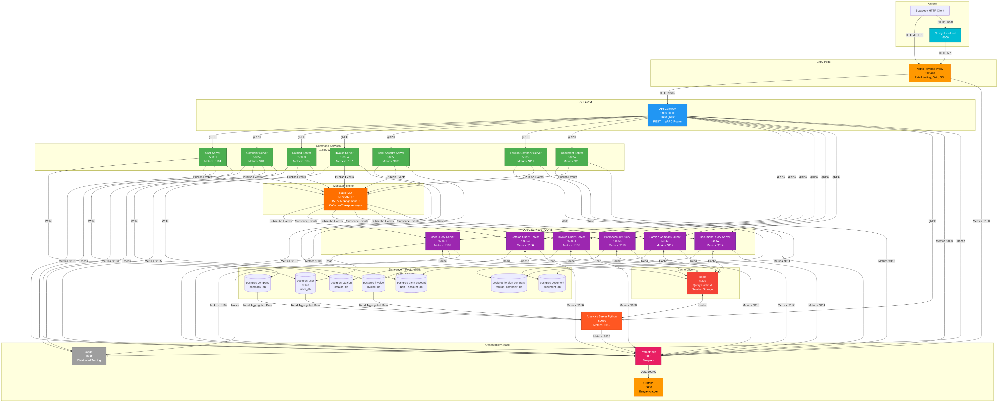
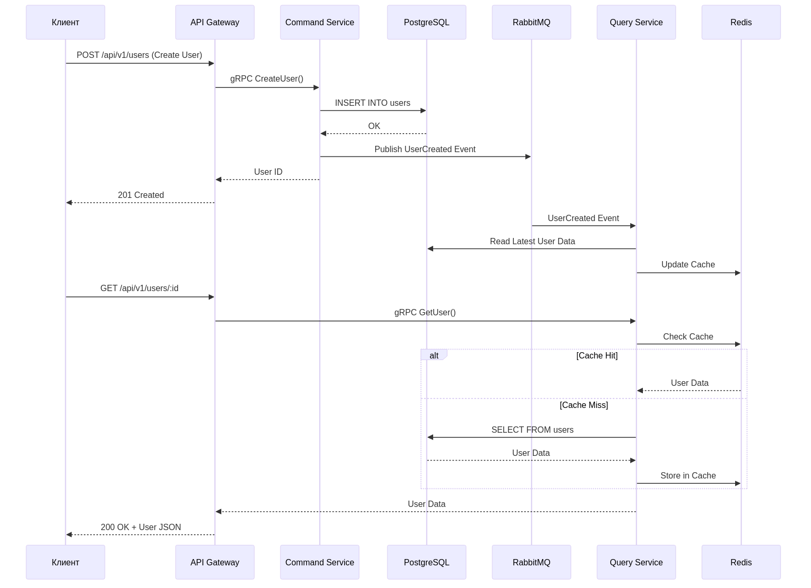
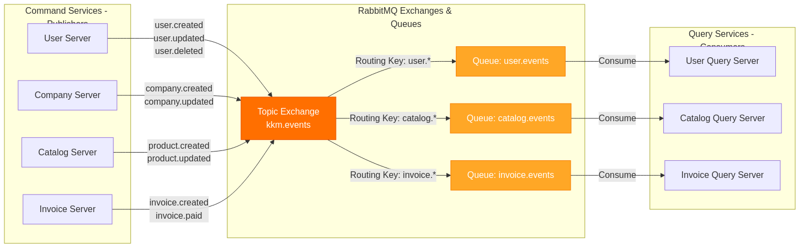
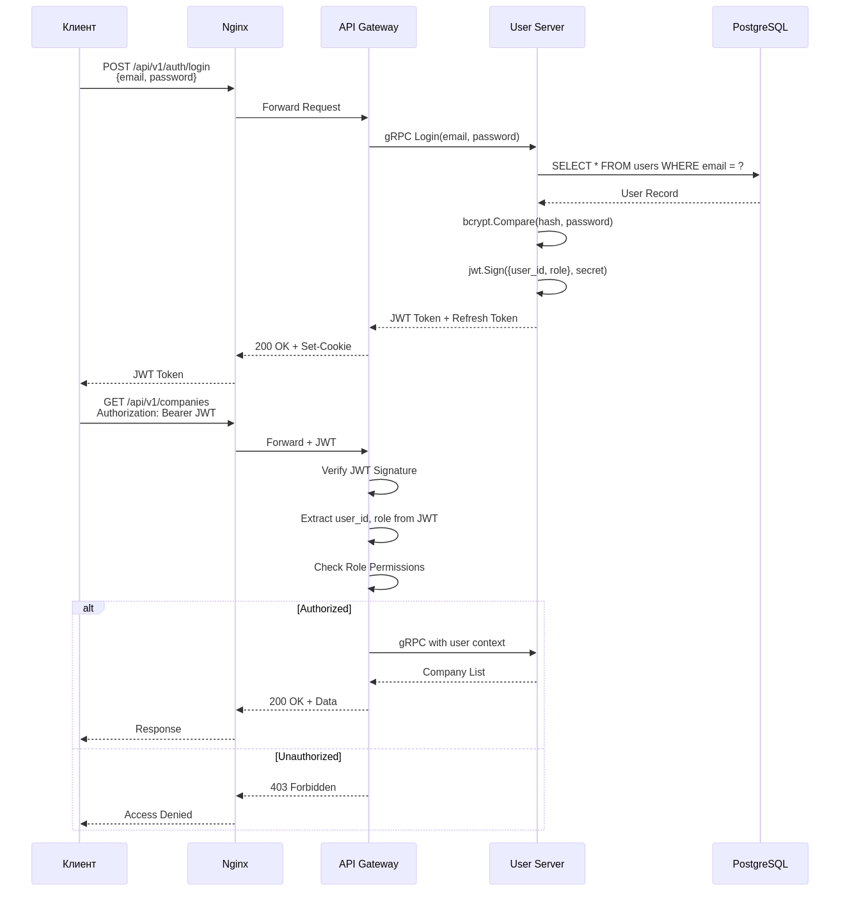

# 🖼️ Архитектурные диаграммы KKM Project MKS

Коллекция визуальных схем микросервисной архитектуры проекта.

## 📊 Доступные диаграммы

### 1. Общая архитектура системы



- **Файлы**: `overall-architecture.mmd` / `overall-architecture.png`
- **Описание**: Полная схема всех 22 сервисов с взаимосвязями
- **Включает**:
  - Command и Query сервисы (CQRS)
  - PostgreSQL базы данных (DB per service)
  - RabbitMQ event bus
  - Redis кэш
  - Мониторинг (Prometheus, Grafana, Jaeger)
  - Nginx Reverse Proxy и API Gateway

### 2. CQRS Pattern - Sequence диаграмма



- **Файлы**: `cqrs-pattern.mmd` / `cqrs-pattern.png`
- **Описание**: Последовательность операций записи и чтения
- **Включает**:
  - Write операция через Command сервис
  - Публикация событий в RabbitMQ
  - Подписка Query сервиса на события
  - Read операция с кэшированием в Redis

### 3. RabbitMQ Event Flow



- **Файлы**: `rabbitmq-events.mmd` / `rabbitmq-events.png`
- **Описание**: Схема взаимодействия через message broker
- **Включает**:
  - Topic Exchange
  - Routing Keys (user._, catalog._, invoice.\*)
  - Queues для каждого домена
  - Publishers (Command Services)
  - Consumers (Query Services)

### 4. Аутентификация и авторизация



- **Файлы**: `auth-flow.mmd` / `auth-flow.png`
- **Описание**: JWT authentication flow
- **Включает**:
  - Процесс логина
  - Генерация JWT токена
  - Авторизация запросов
  - Проверка роли пользователя

## 🛠️ Как редактировать

### Формат исходников

Диаграммы созданы в формате [Mermaid](https://mermaid.js.org/) (`.mmd` файлы).

### Редактирование

1. Откройте `.mmd` файл в любом текстовом редакторе
2. Используйте [Mermaid Live Editor](https://mermaid.live/) для предпросмотра
3. Сохраните изменения

### Генерация PNG

```bash
# Установка mermaid-cli (если не установлен)
npm install -g @mermaid-js/mermaid-cli

# Генерация PNG из Mermaid
mmdc -i overall-architecture.mmd -o overall-architecture.png -b transparent -w 4000
mmdc -i cqrs-pattern.mmd -o cqrs-pattern.png -b transparent -w 2000
mmdc -i rabbitmq-events.mmd -o rabbitmq-events.png -b transparent -w 2500
mmdc -i auth-flow.mmd -o auth-flow.png -b transparent -w 2000
```

### Параметры генерации

- `-i` - входной файл (.mmd)
- `-o` - выходной файл (.png)
- `-b transparent` - прозрачный фон
- `-w` - ширина изображения в пикселях

## 📐 Размеры изображений

| Диаграмма         | Ширина | Формат    |
| ----------------- | ------ | --------- |
| Общая архитектура | 4000px | Landscape |
| CQRS Pattern      | 2000px | Portrait  |
| RabbitMQ Events   | 2500px | Landscape |
| Auth Flow         | 2000px | Portrait  |

## 🎨 Цветовая схема

| Компонент        | Цвет                       |
| ---------------- | -------------------------- |
| Nginx            | Оранжевый (#ff9800)        |
| API Gateway      | Синий (#2196f3)            |
| Frontend         | Cyan (#00bcd4)             |
| Command Services | Зеленый (#4caf50)          |
| Query Services   | Фиолетовый (#9c27b0)       |
| Analytics        | Красно-оранжевый (#ff5722) |
| RabbitMQ         | Оранжевый (#ff6f00)        |
| Redis            | Красный (#f44336)          |
| PostgreSQL       | Синий (#1976d2)            |
| Prometheus       | Розовый (#e91e63)          |
| Grafana          | Оранжевый (#ff9800)        |
| Jaeger           | Серый (#9e9e9e)            |

## 📄 Связанная документация

- [SERVICES_ARCHITECTURE.md](../../SERVICES_ARCHITECTURE.md) - Полная архитектурная документация
- [README.md](../../README.md) - Общее описание проекта
- [docker-compose.yml](../../docker-compose.yml) - Конфигурация сервисов

---

**Последнее обновление:** 30 января 2026
