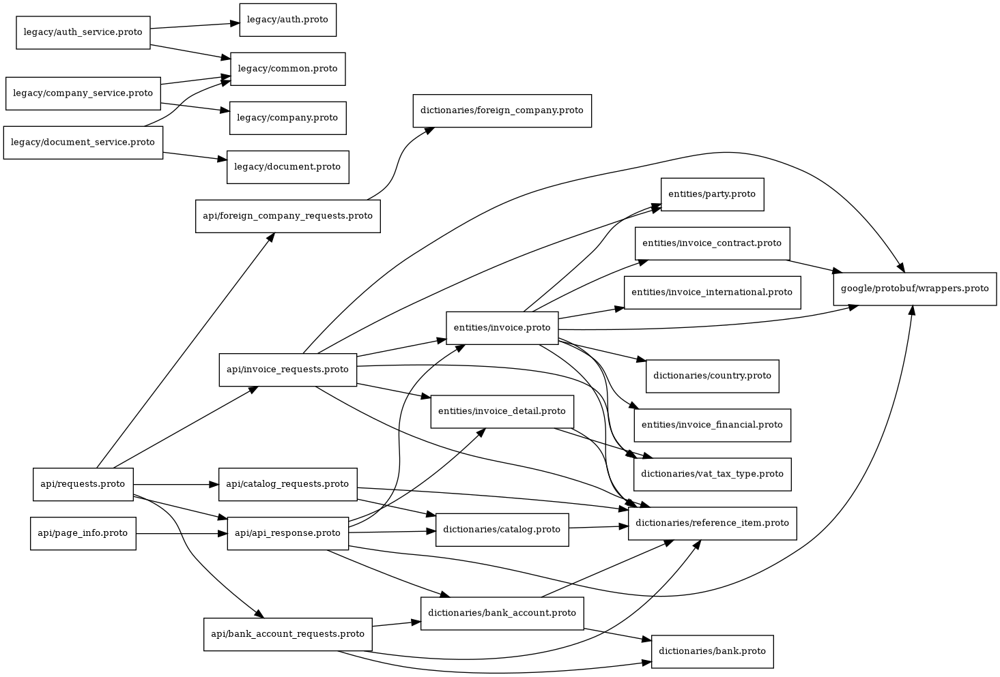

# Proto Services and Dependencies

This document inventories all gRPC services, their RPC methods, and shows proto import relationships.

## Dependency Graph Visualization



_Visual representation of import dependencies between proto files. See [SERVICES_DEP_GRAPH.dot](./SERVICES_DEP_GRAPH.dot) for the source._

## Services and RPCs

- api/invoice_requests.proto

  - service InvoiceCommandService
    - CreateInvoice(CreateInvoiceRequest) → entities.Invoice
    - UpdateInvoice(UpdateInvoiceRequest) → entities.Invoice
    - AcceptOrRejectInvoice(AcceptOrRejectRequest) → entities.Invoice
    - RevokeInvoice(RevokeRequest) → entities.Invoice
    - SignInvoice(SignRequest) → entities.Invoice

- api/catalog_requests.proto

  - service CatalogCommandService
    - CreateCatalog(CreateCatalogRequest) → dictionaries.Catalog
    - UpdateCatalog(UpdateCatalogRequest) → dictionaries.Catalog

- api/bank_account_requests.proto

  - service BankAccountCommandService
    - CreateBankAccount(CreateBankAccountRequest) → dictionaries.BankAccount
    - UpdateBankAccount(UpdateBankAccountRequest) → dictionaries.BankAccount

- api/foreign_company_requests.proto

  - service ForeignCompanyCommandService
    - CreateForeignCompany(CreateForeignCompanyRequest) → dictionaries.ForeignCompany
    - UpdateForeignCompany(UpdateForeignCompanyRequest) → dictionaries.ForeignCompany

- api/page_info.proto

  - service InvoiceQueryService
    - ListInvoices(PageInfo) → APIResponse
    - ListInvoiceDetails(PageInfo) → APIResponse
  - service BankAccountQueryService
    - ListBankAccounts(PageInfo) → APIResponse
  - service CatalogQueryService
    - ListCatalogs(PageInfo) → APIResponse

- api/requests.proto (aggregator)

  - service APICommandService
    - CreateInvoice(CreateInvoiceRequest) → APIResponse
    - UpdateInvoice(UpdateInvoiceRequest) → APIResponse
    - AcceptOrRejectInvoice(AcceptOrRejectRequest) → APIResponse
    - RevokeInvoice(RevokeRequest) → APIResponse
    - SignInvoice(SignRequest) → APIResponse
    - CreateBankAccount(CreateBankAccountRequest) → APIResponse
    - UpdateBankAccount(UpdateBankAccountRequest) → APIResponse
    - CreateCatalog(CreateCatalogRequest) → APIResponse
    - UpdateCatalog(UpdateCatalogRequest) → APIResponse
    - CreateForeignCompany(CreateForeignCompanyRequest) → APIResponse
    - UpdateForeignCompany(UpdateForeignCompanyRequest) → APIResponse

- legacy/auth_service.proto

  - service AuthService
    - Register(RegisterRequest) → AuthResponse
    - Login(LoginRequest) → AuthResponse
    - ValidateToken(ValidateTokenRequest) → User
    - GetUser(GetUserRequest) → User
    - Logout(LogoutRequest) → api.common.Empty
    - RefreshToken(RefreshTokenRequest) → Token

- legacy/company_service.proto

  - service CompanyService
    - GetOrganization(GetOrganizationRequest) → Organization
    - CreateOrganization(CreateOrganizationRequest) → Organization
    - UpdateOrganization(UpdateOrganizationRequest) → Organization
    - DeleteOrganization(DeleteOrganizationRequest) → api.common.Empty
    - ListOrganizations(ListOrganizationsRequest) → ListOrganizationsResponse
    - GetOrganizationMembers(GetOrganizationMembersRequest) → ListEmployeesResponse
    - AddMember(AddMemberRequest) → Employee
    - RemoveMember(RemoveMemberRequest) → api.common.Empty

- legacy/document_service.proto
  - service DocumentService
    - GetDocument(GetDocumentRequest) → Document
    - CreateDocument(CreateDocumentRequest) → Document
    - UpdateDocument(UpdateDocumentRequest) → Document
    - SendDocument(SendDocumentRequest) → Document
    - ApproveDocument(ApproveDocumentRequest) → Document
    - RejectDocument(RejectDocumentRequest) → Document
    - ArchiveDocument(ArchiveDocumentRequest) → Document
    - ListDocuments(ListDocumentsRequest) → ListDocumentsResponse
    - AddDocumentEntry(AddDocumentEntryRequest) → DocumentEntry
    - UpdateDocumentEntry(UpdateDocumentEntryRequest) → DocumentEntry
    - RemoveDocumentEntry(RemoveDocumentEntryRequest) → api.common.Empty
    - GetDocumentHistory(GetDocumentHistoryRequest) → DocumentHistoryResponse

## Import Dependency Graph

A DOT description of proto imports is available at SERVICES_DEP_GRAPH.dot. Preview with Graphviz:

```bash
cd proto
dot -Tpng SERVICES_DEP_GRAPH.dot -o SERVICES_DEP_GRAPH.png
```

### Notes

- api/_ request files depend on entities/_ and dictionaries/\* types.
- Aggregator APICommandService (api/requests.proto) re-exports operations across modules.
- Legacy services remain under proto/legacy and use legacy/\* messages.
